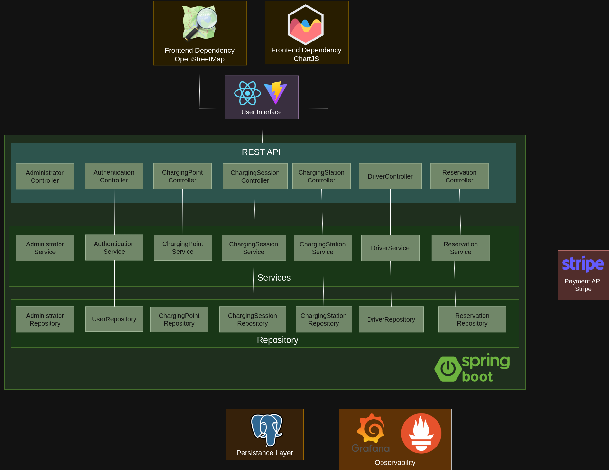

# EcoCharger
Repository for the TQS project EcoCharger


# Team

| Student         | Roles         | Nmec   |
| --------------- | ------------- | ------ |
| Afonso Ferreira     | Team Manager and DevOps Master | 113480  |
| Ricardo Antunes | Q&A Engineer | 115243 |
| Tomás Brás | Product Owner | 112665 |

# Jira Link
[EcoCharger Jira](https://ua-deti-alof.atlassian.net/jira/software/projects/ET/boards/2)

# Abstract

**EcoCharger** is a software application that is designed to improve the electric vehicle (EV) charging ecosystem by addressing the challenges of charging services. The project focuses on delivering a seamless experience for EV drivers and station operators through features such as real-time charging station discovery, slot booking, payment integration, and consumption monitoring.

**EcoCharger** was built following **Software Quality Assurance** and **DevOps** practices, including **Continuous Integration**, **Continuous Delivery**, and **Continuous Testing**. By applying agile methodologies and a test driven development, the project aims to deliver an efficient product that enhances the EV charging experience and management of charging stations.

# Structure

```
├── EcoCharger/                 -- Main project folder
│   ├── docker-compose.yml      -- Docker compose file
│   ├──frontend/                -- Frontend source code
│       ├── Dockerfile          -- Dockerfile for the frontend
│   ├──backend/                 -- Backend source code
│       ├── Dockerfile          -- Dockerfile for the backend
├── minutes/                    -- Minutes of the meetings
├── presentations/              -- Materials used in the presentations
├── README.md                   -- Context
├── reports/                    -- Project specifications
├── resources/                  -- Images and other resources
├── docker-compose.yml          -- Docker compose file
├── k6-oss-workshop-main        -- K6 OSS Workshop
├── grafana                     -- Grafana dashboard and datasource
```

# Architecture
